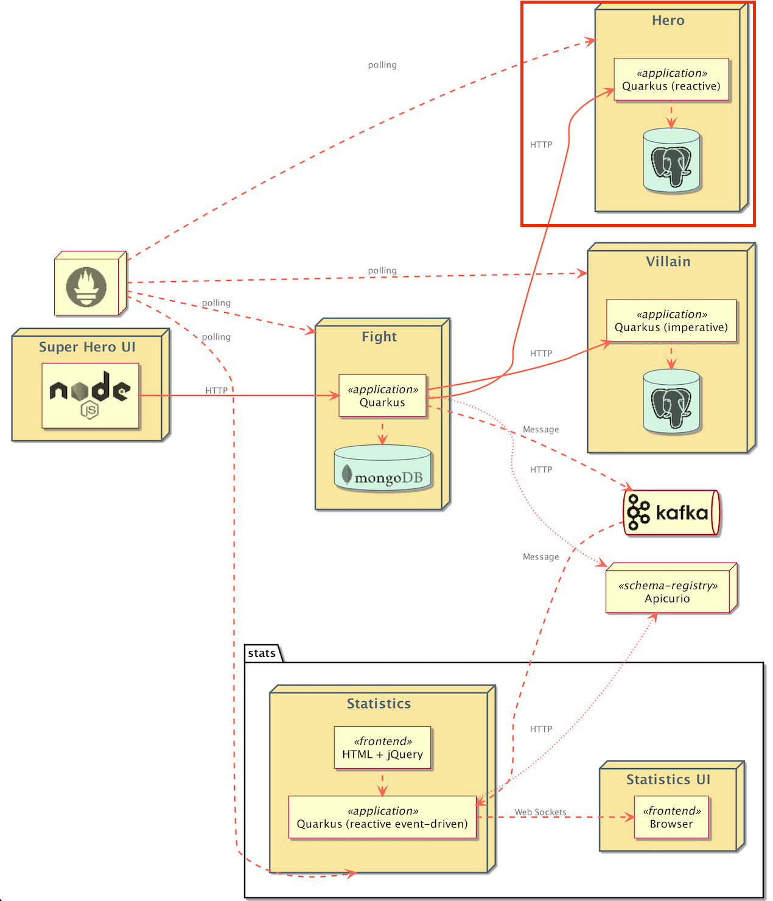
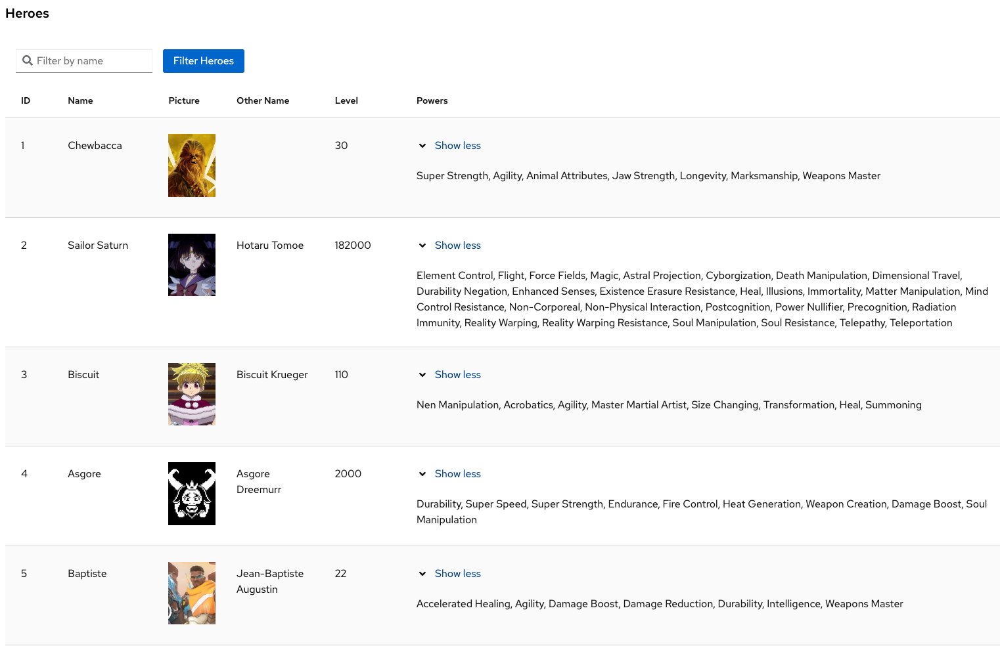

# Superheroes Hero Microservice

## Table of Contents
- [Introduction](#introduction)
    - [Exposed Endpoints](#exposed-endpoints)
- [Contract testing with Pact](#contract-testing-with-pact)
- [Running the Application](#running-the-application)
- [Running Locally via Docker Compose](#running-locally-via-docker-compose)
- [Deploying to Kubernetes](#deploying-to-kubernetes)
    - [Using pre-built images](#using-pre-built-images)
    - [Deploying directly via Kubernetes Extensions](#deploying-directly-via-kubernetes-extensions)

## Introduction
This is the Hero REST API microservice. It is a reactive HTTP microservice exposing CRUD operations on Heroes. Hero information is stored in a PostgreSQL database. This service is implemented using [RESTEasy Reactive](https://quarkus.io/guides/resteasy-reactive) with reactive endpoints and [Quarkus Hibernate Reactive with Panache's repository pattern](https://quarkus.io/guides/hibernate-reactive-panache#solution-2-using-the-repository-pattern).

Additionally, this application favors constructor injection of beans over field injection (i.e. `@Inject` annotation).

### Exposed Endpoints
The following table lists the available REST endpoints. The [OpenAPI document](openapi-schema.yml) for the REST endpoints is also available.

| Path                 | HTTP method | Query Param(s) | Response Status | Response Object                                                            | Description                                                                                                                      |
|----------------------|-------------|----------------|-----------------|----------------------------------------------------------------------------|----------------------------------------------------------------------------------------------------------------------------------|
| `/api/heroes`        | `GET`       | `name_filter`  | `200`           | [`List<Hero>`](src/main/java/io/quarkus/sample/superheroes/hero/Hero.java) | All Heroes. Empty array (`[]`) if none. Optional `name_filter` query parameter for filtering results by name (case-insensitive). |
| `/api/heroes`        | `POST`      |                | `201`           |                                                                            | New Hero created. `Location` header contains URL to retrieve Hero                                                                |
| `/api/heroes`        | `POST`      |                | `400`           |                                                                            | Invalid Hero passed in request body (or no request body found)                                                                   |
| `/api/heroes`        | `DELETE`    |                | `204`           |                                                                            | Deletes all Heroes                                                                                                               |
| `/api/heroes`        | `PUT`       |                | `201`           |                                                                            | Replaces all heroes with the passed-in heroes. `Location` header contains URL to retrieve all Heroes                             |
| `/api/heroes`        | `PUT`       |                | `400`           |                                                                            | Invalid `Hero`s passed in request body (or no request body found)                                                                |
| `/api/heroes/random` | `GET`       |                | `200`           | [`Hero`](src/main/java/io/quarkus/sample/superheroes/hero/Hero.java)       | Random Hero                                                                                                                      |
| `/api/heroes/random` | `GET`       |                | `404`           |                                                                            | No Hero found                                                                                                                    |
| `/api/heroes/{id}`   | `GET`       |                | `200`           | [`Hero`](src/main/java/io/quarkus/sample/superheroes/hero/Hero.java)       | Hero with id == `{id}`                                                                                                           |
| `/api/heroes/{id}`   | `GET`       |                | `404`           |                                                                            | No Hero with id == `{id}` found                                                                                                  |
| `/api/heroes/{id}`   | `PUT`       |                | `204`           |                                                                            | Completely replaces a Hero                                                                                                       |
| `/api/heroes/{id}`   | `PUT`       |                | `400`           |                                                                            | Invalid Hero passed in request body (or no request body found)                                                                   |
| `/api/heroes/{id}`   | `PUT`       |                | `404`           |                                                                            | No Hero with id == `{id}` found                                                                                                  |
| `/api/heroes/{id}`   | `PATCH`     |                | `200`           | [`Hero`](src/main/java/io/quarkus/sample/superheroes/hero/Hero.java)       | Partially updates a Hero. Returns the complete Hero.                                                                             |
| `/api/heroes/{id}`   | `PATCH`     |                | `400`           |                                                                            | Invalid Hero passed in request body (or no request body found)                                                                   |
| `/api/heroes/{id}`   | `PATCH`     |                | `404`           |                                                                            | No Hero with id == `{id}` found                                                                                                  |
| `/api/heroes/{id}`   | `DELETE`    |                | `204`           |                                                                            | Deletes Hero with id == `{id}`                                                                                                   |
| `/api/heroes/hello`  | `GET`       |                | `200`           | `String`                                                                   | Ping "hello" endpoint                                                                                                            |

## Contract testing with Pact
[Pact](https://pact.io) is a code-first tool for testing HTTP and message integrations using `contract tests`. Contract tests assert that inter-application messages conform to a shared understanding that is documented in a contract. Without contract testing, the only way to ensure that applications will work correctly together is by using expensive and brittle integration tests.

[Eric Deandrea](https://developers.redhat.com/author/eric-deandrea) and [Holly Cummins](https://hollycummins.com) recently spoke about contract testing with Pact and used the Quarkus Superheroes for their demos. [Watch the replay](https://www.youtube.com/watch?v=vYwkDPrzqV8) and [view the slides](https://hollycummins.com/modern-microservices-testing-pitfalls-devoxx/) if you'd like to learn more about contract testing.

The `rest-heroes` application is a [Pact _Provider_](https://docs.pact.io/provider), and as such, should run provider verification tests against contracts produced by consumers.

As [this README states](src/test/resources/pacts/README.md), contracts generally should be hosted in a [Pact Broker](https://docs.pact.io/pact_broker) and then automatically discovered in the provider verification tests.

One of the main goals of the Superheroes application is to be super simple and just "work" by anyone who may clone this repo. That being said, we can't make any assumptions about where a Pact broker may be or any of the credentials required to access it.

Therefore, the [Pact contract](src/test/resources/pacts/rest-fights-rest-heroes.json) is committed into this application's source tree inside the [`src/test/resources/pacts` directory](src/test/resources/pacts).

Additionally, Pact provider verification tests don't currently work with Quarkus dev mode and continuous testing. Therefore, the [contract verification tests](src/test/java/io/quarkus/sample/superheroes/hero/ContractVerificationTests.java) are only executed if the `-DrunContractVerificationTests=true` flag is passed. You could do this when running `./mvnw test`, `./mvnw verify`, or `./mvnw package`.

The provider verification tests **ARE** executed during this project's CI/CD processes. They run against any pull requests and any commits back to the `main` branch.

There is a [Quarkus Pact extension](https://github.com/quarkiverse/quarkus-pact) under development aiming to make integration with Pact simple and easy. It will be integrated with this project once it becomes available.

## Running the Application
The application runs on port `8083` (defined by `quarkus.http.port` in [`application.yml`](src/main/resources/application.yml)).

From the `quarkus-super-heroes/rest-heroes` directory, simply run `./mvnw quarkus:dev` to run [Quarkus Dev Mode](https://quarkus.io/guides/maven-tooling#dev-mode), or running `quarkus dev` using the [Quarkus CLI](https://quarkus.io/guides/cli-tooling). The application will be exposed at http://localhost:8083 and the [Quarkus Dev UI](https://quarkus.io/guides/dev-ui) will be exposed at http://localhost:8083/q/dev.

The application also contains a simple UI, showing the list of Heroes currently stored. This UI is available at the root path (http://localhost:8083). The UI is built using the [Quarkus Qute templating engine](https://quarkus.io/guides/qute).

**NOTE:** Running the application outside of Quarkus dev mode requires standing up a PostgreSQL instance and binding it to the app. By default, the application is configured with the following:

| Description       | Environment Variable              | Java Property                     | Value                                         |
|-------------------|-----------------------------------|-----------------------------------|-----------------------------------------------|
| Database URL      | `QUARKUS_DATASOURCE_REACTIVE_URL` | `quarkus.datasource.reactive.url` | `postgresql://localhost:5432/heroes_database` |
| Database username | `QUARKUS_DATASOURCE_USERNAME`     | `quarkus.datasource.username`     | `superman`                                    |
| Database password | `QUARKUS_DATASOURCE_PASSWORD`     | `quarkus.datasource.password`     | `superman`                                    |

## Running Locally via Docker Compose
Pre-built images for this application can be found at [`quay.io/quarkus-super-heroes/rest-heroes`](https://quay.io/repository/quarkus-super-heroes/rest-heroes?tab=tags). 

Pick one of the 4 versions of the application from the table below and execute the appropriate docker compose command from the `quarkus-super-heroes/rest-heroes` directory.

   > **NOTE**: You may see errors as the applications start up. This may happen if an application completes startup before one if its required services (i.e. database, kafka, etc). This is fine. Once everything completes startup things will work fine.

| Description | Image Tag       | Docker Compose Run Command                                               |
|-------------|-----------------|--------------------------------------------------------------------------|
| JVM Java 11 | `java11-latest` | `docker compose -f deploy/docker-compose/java11.yml up --remove-orphans` |
| JVM Java 17 | `java17-latest` | `docker compose -f deploy/docker-compose/java17.yml up --remove-orphans` |
| Native      | `native-latest` | `docker compose -f deploy/docker-compose/native.yml up --remove-orphans` |

These Docker Compose files are meant for standing up this application and the required database only. If you want to stand up the entire system, [follow these instructions](../README.md#running-locally-via-docker-compose).

Once started the application will be exposed at `http://localhost:8083`.

## Deploying to Kubernetes
The application can be [deployed to Kubernetes using pre-built images](#using-pre-built-images) or by [deploying directly via the Quarkus Kubernetes Extension](#deploying-directly-via-kubernetes-extensions). Each of these is discussed below.

### Using pre-built images
Pre-built images for this application can be found at [`quay.io/quarkus-super-heroes/rest-heroes`](https://quay.io/repository/quarkus-super-heroes/rest-heroes?tab=tags).

Deployment descriptors for these images are provided in the [`deploy/k8s`](deploy/k8s) directory. There are versions for [OpenShift](https://www.openshift.com), [Minikube](https://quarkus.io/guides/deploying-to-kubernetes#deploying-to-minikube), [Kubernetes](https://www.kubernetes.io), and [KNative](https://knative.dev).

Pick one of the 4 versions of the application from the table below and deploy the appropriate descriptor from the [`deploy/k8s` directory](deploy/k8s).

| Description | Image Tag       | OpenShift Descriptor                                      | Minikube Descriptor                                     | Kubernetes Descriptor                                       | KNative Descriptor                                    |
|-------------|-----------------|-----------------------------------------------------------|---------------------------------------------------------|-------------------------------------------------------------|-------------------------------------------------------|
| JVM Java 11 | `java11-latest` | [`java11-openshift.yml`](deploy/k8s/java11-openshift.yml) | [`java11-minikube.yml`](deploy/k8s/java11-minikube.yml) | [`java11-kubernetes.yml`](deploy/k8s/java11-kubernetes.yml) | [`java11-knative.yml`](deploy/k8s/java11-knative.yml) |
| JVM Java 17 | `java17-latest` | [`java17-openshift.yml`](deploy/k8s/java17-openshift.yml) | [`java17-minikube.yml`](deploy/k8s/java17-minikube.yml) | [`java17-kubernetes.yml`](deploy/k8s/java17-kubernetes.yml) | [`java17-knative.yml`](deploy/k8s/java17-knative.yml) |
| Native      | `native-latest` | [`native-openshift.yml`](deploy/k8s/native-openshift.yml) | [`native-minikube.yml`](deploy/k8s/native-minikube.yml) | [`native-kubernetes.yml`](deploy/k8s/native-kubernetes.yml) | [`native-knative.yml`](deploy/k8s/native-knative.yml) |

The application is exposed outside of the cluster on port `80`.

These are only the descriptors for this application and the required database only. If you want to deploy the entire system, [follow these instructions](../README.md#deploying-to-kubernetes).

### Deploying directly via Kubernetes Extensions
Following the [deployment section](https://quarkus.io/guides/deploying-to-kubernetes#deployment) of the [Quarkus Kubernetes Extension Guide](https://quarkus.io/guides/deploying-to-kubernetes) (or the [deployment section](https://quarkus.io/guides/deploying-to-openshift#build-and-deployment) of the [Quarkus OpenShift Extension Guide](https://quarkus.io/guides/deploying-to-openshift) if deploying to [OpenShift](https://openshift.com)), you can run one of the following commands to deploy the application and any of its dependencies (see [Kubernetes (and variants) resource generation](../docs/automation.md#kubernetes-and-variants-resource-generation) of the [automation strategy document](../docs/automation.md)) to your preferred Kubernetes distribution.

> **NOTE:** For non-OpenShift or minikube Kubernetes variants, you will most likely need to [push the image to a container registry](https://quarkus.io/guides/container-image#pushing) by adding the `-Dquarkus.container-image.push=true` flag, as well as setting the `quarkus.container-image.registry`, `quarkus.container-image.group`, and/or the `quarkus.container-image.name` properties to different values.

| Target Platform        | Java Version | Command                                                                                                    |
|------------------------|:------------:|------------------------------------------------------------------------------------------------------------|
| Kubernetes             |      11      | `./mvnw clean package -Dquarkus.profile=kubernetes -Dquarkus.kubernetes.deploy=true -DskipTests`           |
| Kubernetes             |      17      | `./mvnw clean package -Dquarkus.profile=kubernetes-17 -Dquarkus.kubernetes.deploy=true -DskipTests`        |
| OpenShift              |      11      | `./mvnw clean package -Dquarkus.profile=openshift -Dquarkus.kubernetes.deploy=true -DskipTests`            |
| OpenShift              |      17      | `./mvnw clean package -Dquarkus.profile=openshift-17 -Dquarkus.kubernetes.deploy=true -DskipTests`         |
| Minikube               |      11      | `./mvnw clean package -Dquarkus.profile=minikube -Dquarkus.kubernetes.deploy=true -DskipTests`             |
| Minikube               |      17      | `./mvnw clean package -Dquarkus.profile=minikube-17 -Dquarkus.kubernetes.deploy=true -DskipTests`          |
| KNative                |      11      | `./mvnw clean package -Dquarkus.profile=knative -Dquarkus.kubernetes.deploy=true -DskipTests`              |
| KNative                |      17      | `./mvnw clean package -Dquarkus.profile=knative-17 -Dquarkus.kubernetes.deploy=true -DskipTests`           |
| KNative (on OpenShift) |      11      | `./mvnw clean package -Dquarkus.profile=knative-openshift -Dquarkus.kubernetes.deploy=true -DskipTests`    |
| KNative (on OpenShift) |      17      | `./mvnw clean package -Dquarkus.profile=knative-openshift-17 -Dquarkus.kubernetes.deploy=true -DskipTests` |

You may need to adjust other configuration options as well (see [Quarkus Kubernetes Extension configuration options](https://quarkus.io/guides/deploying-to-kubernetes#configuration-options) and [Quarkus OpenShift Extension configuration options](https://quarkus.io/guides/deploying-to-openshift#configuration-reference)).

> The [`do_build` function in the `generate-k8s-resources.sh` script](../scripts/generate-k8s-resources.sh) uses these extensions to generate the manifests in the [`deploy/k8s` directory](deploy/k8s).
